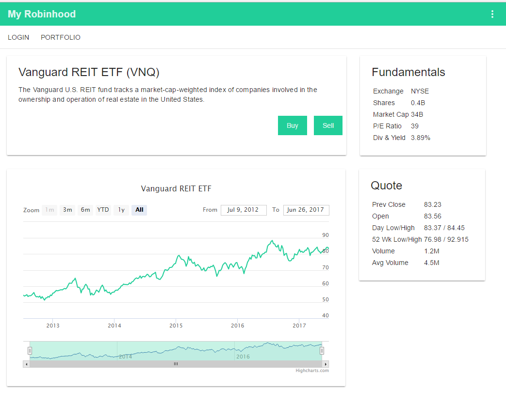

# robinhood-ui
 A web UI for Robinhood (Free Stock Trading app) powered by Angular (4+) and RxJs. This unsupported project uses the official Robinhood API https://api.robinhood.com/ 
 


# Features
* Login with support for two factor auth.
* Export positions as CSV
* Export transaction data as CSV
* Portfolio grid (filter, sorting)
* Charting with HighCharts
* Individual Stock view
* Buy Sell



# How to start

** IMPORTANT ** To run in web browser you will need disable Cross Domain check in order to interact the Robinhood API. For Chrome you can run:
`"C:\Program Files (x86)\Google\Chrome\Application\chrome.exe" --disable-web-security --user-data-dir="c:/nocoors`

* For tooling documentaiton please visit the angular-seed page https://github.com/mgechev/angular-seed/ 
**Note** that this project requires node v4.x.x or higher and npm 2.14.7 but in order to be able to take advantage of the complete functionality we **strongly recommend node >=v6.5.0 and npm >=3.10.3**.

In order to start the project use:

```bash
$ git clone https://github.com/nickaranz/robinhood-ui.git
$ cd robinhood-ui

# install the project's dependencies
$ npm install
# fast install (via Yarn, https://yarnpkg.com)
$ yarn install  # or yarn

# watches your files and uses livereload by default
$ npm start

# to start deving with livereload site and coverage as well as continuous testing
$ npm run start.deving

# dev build
$ npm run build.dev
# prod build, will output the production application in `dist/prod`
# the produced code can be deployed (rsynced) to a remote server
$ npm run build.prod
